# NASSCOM-VSD-SOC
This repository consists of a 5 Day workshop conducted by NASSCOM and VSD on SOC Design and Planning. Also, this includes all the 5 Days learning from videos provided by VSD and LAB work on the OpenLANE tool provided by NASSCOM.  
Author- Tanmay Agrawal
 
## Table Of Content
<ol>
  <li>
    <a href= "#day-1">Day-1: Inception of open-source EDA, OpenLANE and Sky130 PDK.</a>
  </li>
  <li><a href="day-2">Day-2: Inception of open-source EDA, OpenLANE and Sky130 PDK.</a></li>
  <li><a href="day-3">Day-3: Inception of open-source EDA, OpenLANE and Sky130 PDK.</a></li>
  <li><a href="day-4">Day-4: Inception of open-source EDA, OpenLANE and Sky130 PDK.</a></li>
  <li><a href="day-5">Day-5: Inception of open-source EDA, OpenLANE and Sky130 PDK.</a></li>
</ol>
 

## DAY-1
### Title: Inception Of Open-Source EDA, OpenLANE and Sky130 PDK.

<h5>CONTENT:</h5>
<ol>
  <li>SKY130_D1_SK1: How to talk to computers</li>
  <li>SKY130_D1_SK2: SOC Design and OpenLANE</li>
  <li>SKY130_D1_SK3: Get familiar to open-source EDA tools</li>
</ol>

### 1. SKY130_D1_SK1: How to talk to computer

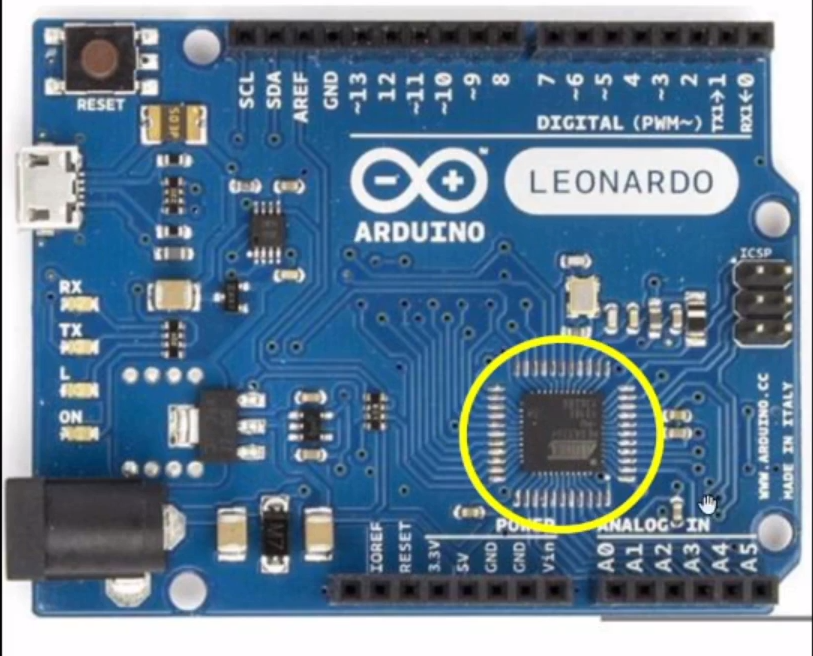
 
This is the Arduino Leonardo board consisting of a Processor/SOC and various other interconnecting devices and peripherals. 
The highlighted part in the above figure is the on block where the entire VLSI moves around.  
The picture below dipicts the layout of the entire microcontroller board. 
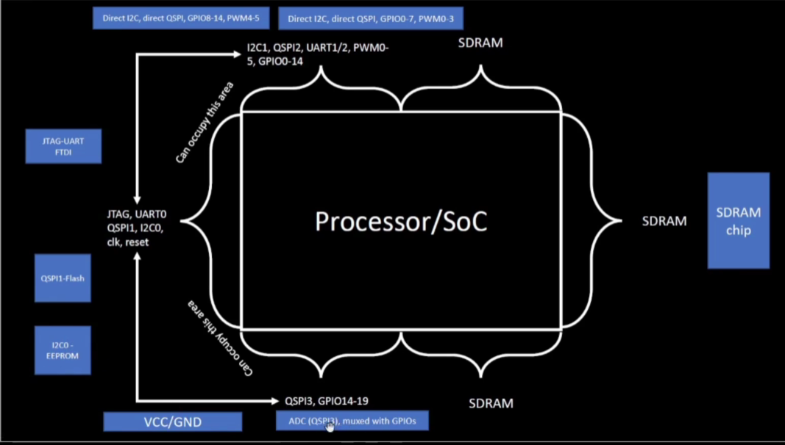
 
Thus, this picture consists of various interconnect devices, external chips and various other devices present. Few features of this layout are: 
<ul>
  <li>The Centre part the processor/ SOC is the layout of the Chip that is highlighted on an Arduino Board.</li>
  <li>It comprises of various other devices like SRAM, EEPROM, ADCs and various other components that are combined and placed to make a microcontroller board </li>
</ul>
 
But, our main objective is to design a Processor/ SOC so the picture below depicts the design of a QFN-48 Package with the chip in the middle of it connected by bond wires or interconnect wires.
 
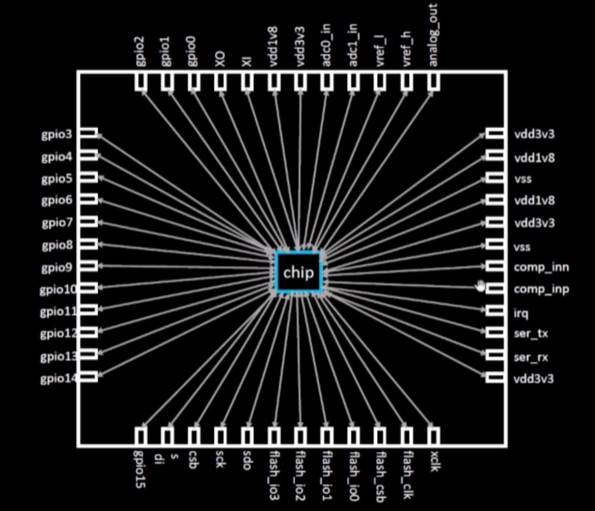
 
Also this Package comprises of a Die, I/O Pads, core. The layout of this is depicted below: 
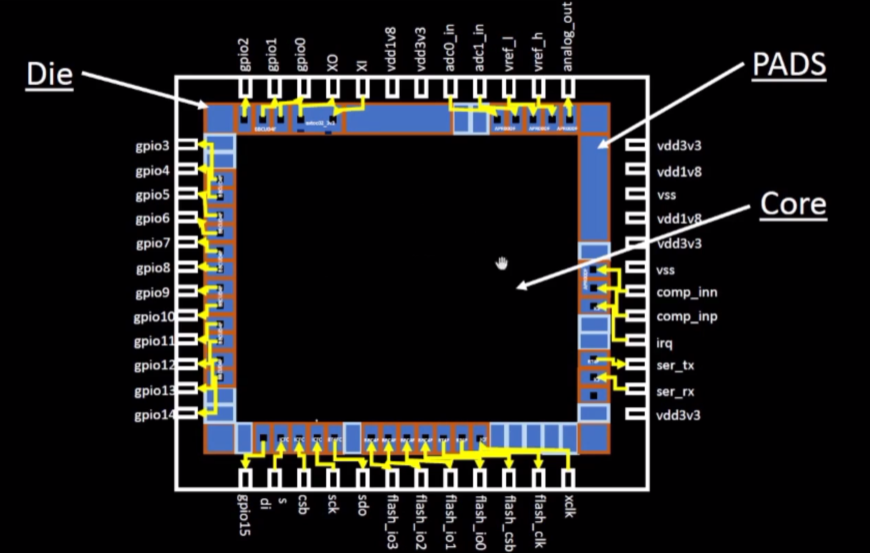
 
Now, the core of this SOC consists of the Two major parts these are: 
<ul>
  <li>Foundry IP's: These the factories that helps to implement the design on the silicon wafer and also to make chips by there intelligence. These chips made by the foundrys are termed as foundry Intellectual Property.</li>
  <li>Macros: These are like a pure digital logics.</li>
</ul>
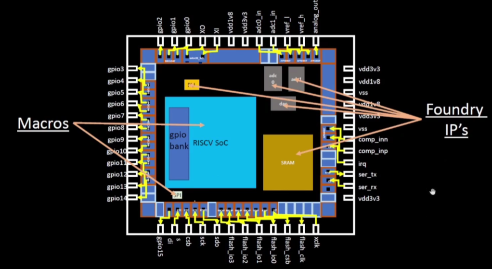
 
As, we are using RISC V Architecture also called Instruction Set Architecture (ISA) to design an SOC. The picture below depicts the flow from RTL2GDS.
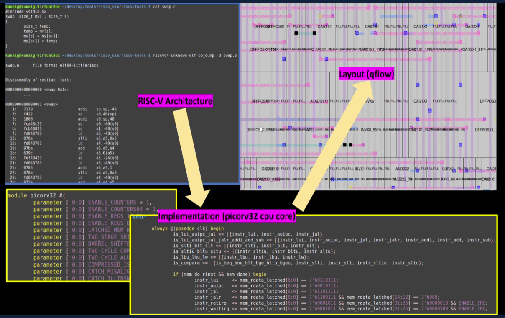
 
Now, Let's move on to how the Software Applications connects to Hardwares. 
Shown, below is the entire flow of how the software connects to Hardware.
 
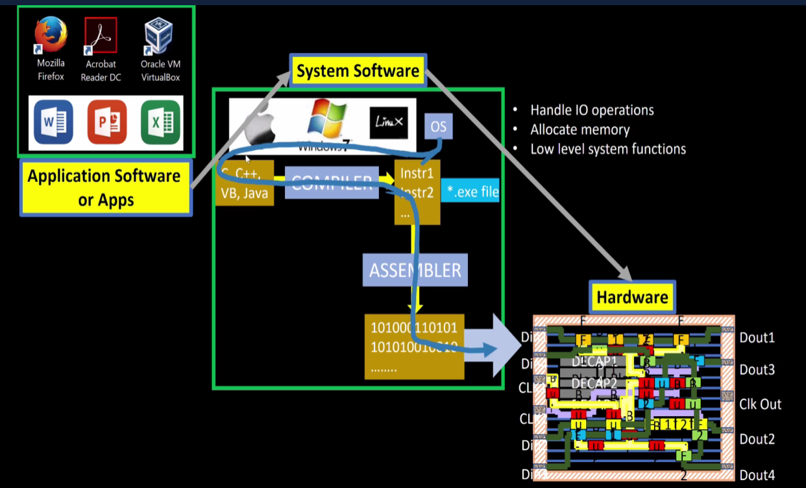
 
Now, we are taking the example of a stop watch flow and the implementation is done using RISCV Architecture. 
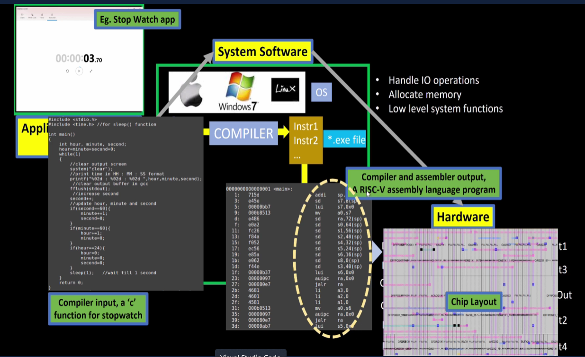
 
Thus, deep diving into the flow we observed that there is one more process after the Assembler is the use of HDL(Hardware Descriptive Language). 
We, convert the Binary Code into the HDL that signifies that what is the function that the entire hardware will be performing with that bit stream. 
Then, the next step after this is we synthesize the RTL flow for Physical Design Implementation. 
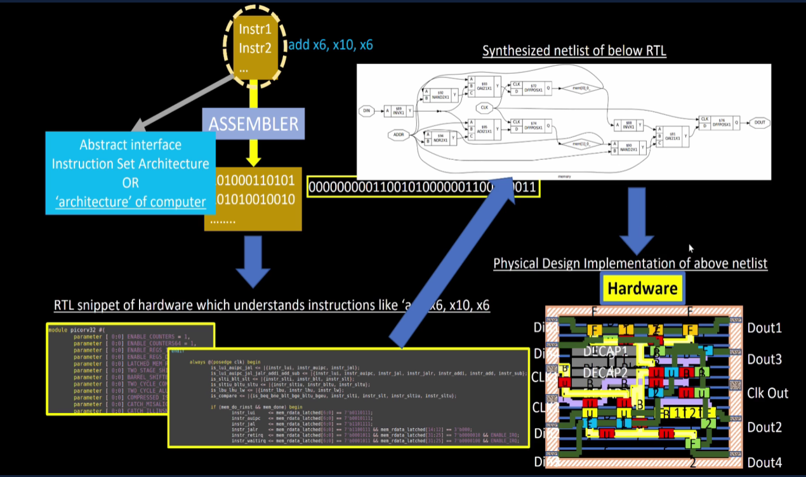
 

### 2. SKY130_D1_SK2: SOC Design and OpenLANE

 
 Let's understand the standard RTL to GDSII Flow. This is described below using the flow diagram:
  
 
  
 Now, let's take the first stage in the flow: 
 Synthesis: It Converts RTL to a circuit out of components from the standard cell library (SCL). 
 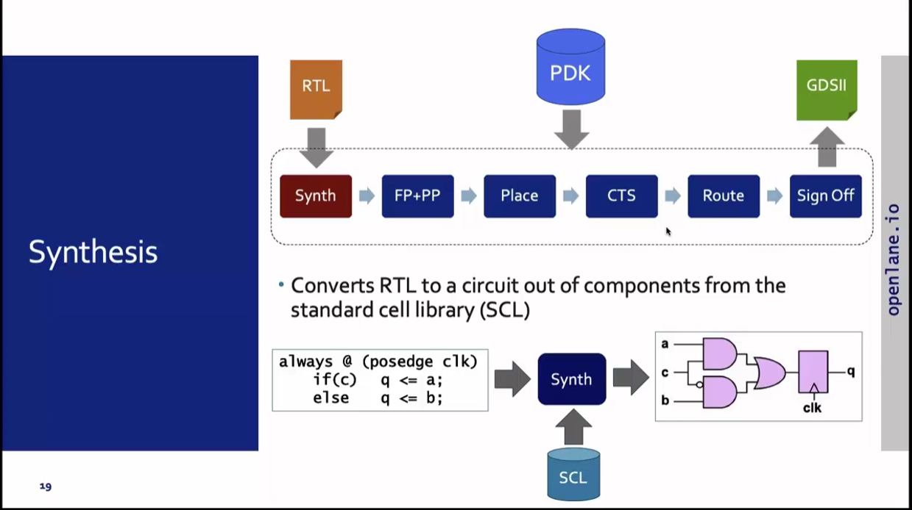
  
 The other stage is: 
 Floor and Power Planning: It is divided into two categories that are : 
 <ol>
   <li>Chip-Floor Planning: Partition the chip die between different system building blocks and place the I/O Pads.</li>
   <li>Macro-Floor Planning: Dimensions, pin locations, rows definition.</li>
 </ol>
 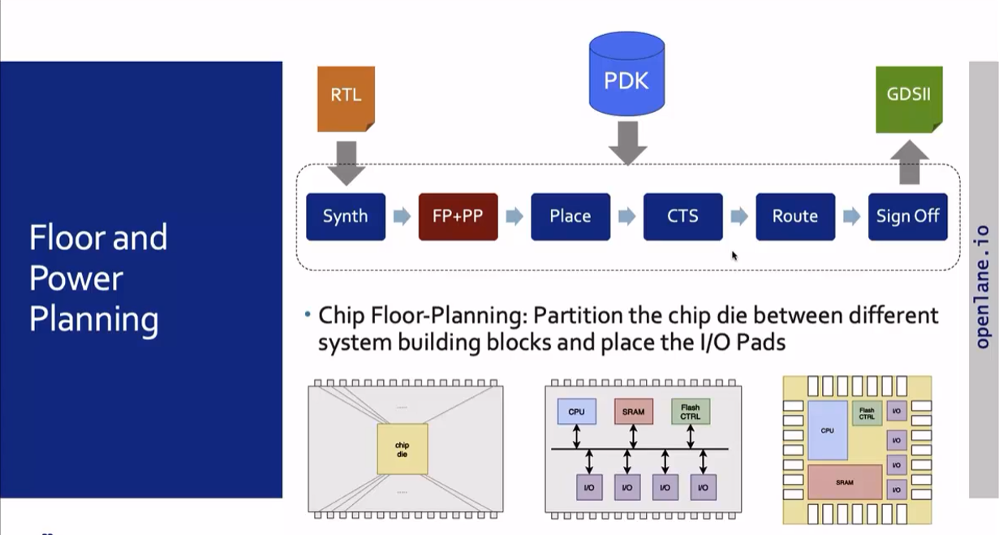 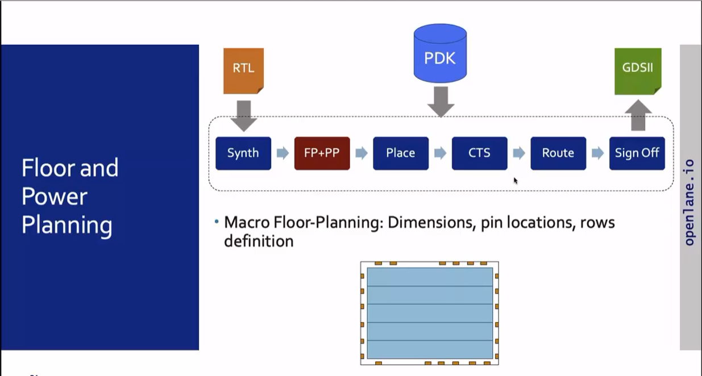 
 Power Planning: The power network is connected by multiple vdd, vss and gnd.
  
 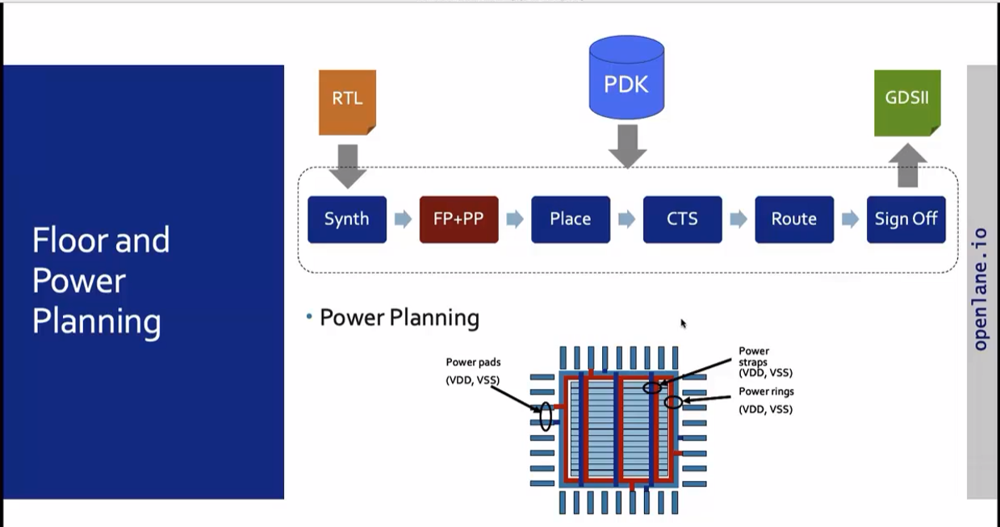
  
 The next stage is: 
 Placement: Placing the cells on the floorplan rows, aligned with the sites. 
 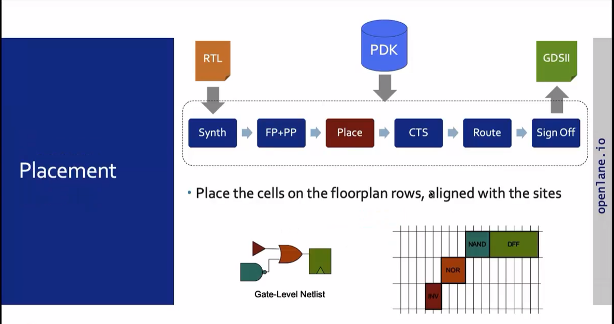
  
 Placement is divided into 2 steps: Global and Detailed Placement. 
 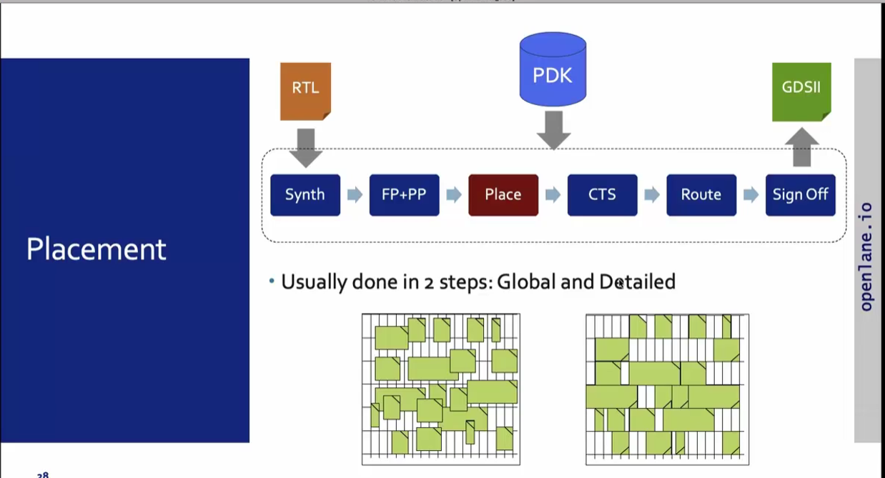
  
 The next stage is: 
 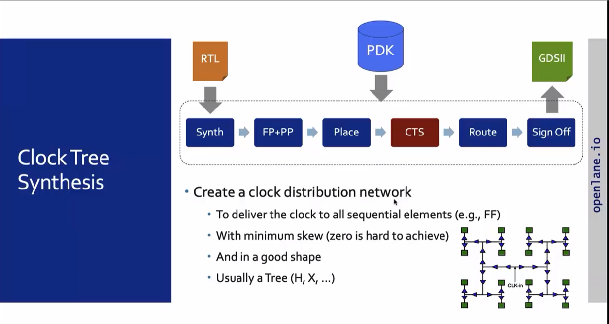
  
The next stage is: 
 
  
 The next stage is: 
 
  
 

### 3. SKY130_D1_SK3: Get familiar to open-source EDA tools
 
 

 
 
 
 
 
 
 
