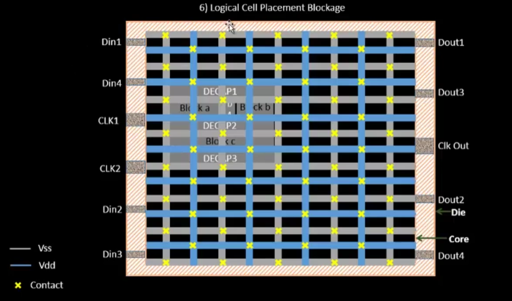

# NASSCOM-VSD-SOC
This repository consists of a 5 Day workshop conducted by NASSCOM and VSD on SOC Design and Planning. Also, this includes all the 5 Days learning from videos provided by VSD and LAB work on the OpenLANE tool provided by NASSCOM.<br><br>
Author- Tanmay Agrawal
<br>
## Table Of Content
<ol>
  <li>
    <a href= "#day-1">Day-1: Inception of open-source EDA, OpenLANE and Sky130 PDK.</a>
  </li>
  <li><a href="#day-2">Day-2: Good floorplan vs bad floorplan and introduction to library cells.</a></li>
  <li><a href="#day-3">Day-3: Design library cell using Magic Layout and ngspice characterization.</a></li>
  <li><a href="#day-4">Day-4: Pre-layout timing analysis and importance of good clock tree.</a></li>
  <li><a href="#day-5">Day-5: Final steps for RTL2GDS using tritonRoute and openSTA.</a></li>
</ol>
<br>

## DAY-1
### Title: Inception Of Open-Source EDA, OpenLANE and Sky130 PDK.
<hr>
<h5>CONTENT:</h5>
<ol>
  <li><a href="#1-how-to-talk-to-computer">How to talk to computers</a></li>
  <li><a href="#2-soc-design-and-openlane">SOC Design and OpenLANE</a></li>
  <li><a href="#3-get-familiar-to-open-source-eda-tools">Get familiar to open-source EDA tools</a></li>
</ol>
<hr>

### 1. How to talk to computer
<hr>

<br>
This is the Arduino Leonardo board consisting of a Processor/SOC and various other interconnecting devices and peripherals.<br>
The highlighted part in the above figure is the on block where the entire VLSI moves around.<br><br>
The picture below dipicts the layout of the entire microcontroller board.<br>

<br>
Thus, this picture consists of various interconnect devices, external chips and various other devices present. Few features of this layout are:<br>
<ul>
  <li>The Centre part the processor/ SOC is the layout of the Chip that is highlighted on an Arduino Board.</li>
  <li>It comprises of various other devices like SRAM, EEPROM, ADCs and various other components that are combined and placed to make a microcontroller board </li>
</ul>
<br>
But, our main objective is to design a Processor/ SOC so the picture below depicts the design of a QFN-48 Package with the chip in the middle of it connected by bond wires or interconnect wires.
<br>

<br>
Also this Package comprises of a Die, I/O Pads, core. The layout of this is depicted below:<br>

<br>
Now, the core of this SOC consists of the Two major parts these are:<br>
<ul>
  <li>Foundry IP's: These the factories that helps to implement the design on the silicon wafer and also to make chips by there intelligence. These chips made by the foundrys are termed as foundry Intellectual Property.</li>
  <li>Macros: These are like a pure digital logics.</li>
</ul>

<br>
As, we are using RISC V Architecture also called Instruction Set Architecture (ISA) to design an SOC. The picture below depicts the flow from RTL2GDS.

<br>
Now, Let's move on to how the Software Applications connects to Hardwares.<br>
Shown, below is the entire flow of how the software connects to Hardware.
<br>

<br>
Now, we are taking the example of a stop watch flow and the implementation is done using RISCV Architecture.<br>

<br>
Thus, deep diving into the flow we observed that there is one more process after the Assembler is the use of HDL(Hardware Descriptive Language).<br>
We, convert the Binary Code into the HDL that signifies that what is the function that the entire hardware will be performing with that bit stream.<br>
Then, the next step after this is we synthesize the RTL flow for Physical Design Implementation.<br>

<br>
<hr>

### 2. SOC Design and OpenLANE

<hr>
<br>
 Let's understand the standard RTL to GDSII Flow. This is described below using the flow diagram:
 <br>
 
 <br>
 Now, let's take the first stage in the flow:<br>
 Synthesis: It Converts RTL to a circuit out of components from the standard cell library (SCL).<br>
 
 <br>
 The other stage is:<br>
 Floor and Power Planning: It is divided into two categories that are :<br>
 <ol>
   <li>Chip-Floor Planning: Partition the chip die between different system building blocks and place the I/O Pads.</li>
   <li>Macro-Floor Planning: Dimensions, pin locations, rows definition.</li>
 </ol>
 <br><br>
 Power Planning: The power network is connected by multiple vdd, vss and gnd.
 <br>
 
 <br>
 The next stage is:<br>
 Placement: Placing the cells on the floorplan rows, aligned with the sites.<br>
 
 <br>
 Placement is divided into 2 steps: Global and Detailed Placement.<br>
 
 <br>
 The next stage is:<br>
 
 <br>
The next stage is:<br>
 
 <br>
 The next stage is:<br>
 
 <br>
 <hr>

### 3. Get familiar to open-source EDA tools
 
 <hr>

 Let's Dive into the OpenLane toolkit provided to access the open-source software helping in the complete flow from RTL to GDSII.<br>
 <br>
 Now, First we try to get into the working directory on which we have to work to access the OpenLANE flow.<br>
 
 <br>
 The Path for the current working directory to operate will be:<br>
 ```console
 vsduser@vsdsquadron:~/Desktop/work/tools/openlane_workshop_dir/openlane/
```
<br>
 After entering into the above mentioned directory type command-<br>
 
```console
 vsduser@vsdsquadron:~/Desktop/work/tools/openlane_workshop_dir/openlane$ docker
```
<br>
to access all the tools available in the openLANE. Then command to start the session will be:<br>

```console
bash-4.2$ flow.tcl -interactive
```
<br>
 
 <br>
 By the meantime we can also explore the /openlane dir. Below are the listed item present in <br>
 
 ```console
 vsduser@vsdsquadron:~/Desktop/work/tools/openlane_workshop_dir/openlane$ cd designs/
 ```
 <br>
 
 <br>
 Coming back to the OpenLane interactive session. We will be preparing the design file for picorv32a. Command for preparing will be <br>
 
 ```console
 % prep -design picorv32a 
 ```
 <br>
 
 <br>
 After this for synthesizing the design we run the command <br>
 
 ```console
 % run_synthesis
 ```
 <br>
 
 <br>
 Now, switch to the design directory in the openlane directory. The cd to <br>
 
 ```console
 vsduser@vsdsquadron:~/Desktop/work/tools/openlane_workshop_dir/openlane/designs/picorv32a/runs/15-03_19-57$ cd reports/synthesis/less 1-yosys_4.stat.rpt
 ```
 to print the synthesis statistics.<br>
 
 <br>
 To calculate the Flop-Ratio:<br>
 Flop-Ratio= (Total number of D-Flip-Flops)/(Total number of cells)<br>
 %Flop-Ratio= Flop-Ratio*100%<br>
 Below represents the statistics of the synthesis:<br>
 <br><br><br>
<br>
Hence, from the above obtained statistics the Flop-Ratio will be:<br>
Flop-Ratio=(1613/14876)=0.1084296<br>
% Flop-Ratio = 10.84%<br>
<br>
This ENDS with the DAY1 workshop using an OpenLANE Toolkit.
<br>
<br>


## DAY-2
### TITLE: Good floorplan vs bad floorplan and introduction to library cells.
<hr>
<h5>CONTENT:</h5>
<ol>
  <li><a href="#1-chip-floor-planning-considerations">Chip Floor Planning considerations</a></li>
  <li><a href="#2-library-binding-and-placement">Library Binding and Placement</a></li>
  <li><a href="#">Cell design and characterization flows</a></li>
  <li><a href="#">General timing characterization parameters</a></li>
</ol>
<hr>

### 1. Chip Floor Planning considerations
<hr>
<br>
This module begins with the basic concepts of floor planning that includes netlisting defining width and height of core and die.<br>
Now let's begin by defining the Netlist: It describes the connectivity between all the Electronic components.<br>
Below, represents the netlisting of the various Flip-Flops and logic gates.<br>
<br>
For, placing the netlist in the core of the chip we need to convert the logic gates into the specified physical dimensions. So, that they are to correctly placed inside the core.<br>
Below, is the representation of the conversion of netlist into physical dimensions.<br>
<br>
Now, to calculate the exact dimensions of the core and die we need to first specify the dimensions of the standard cells (logic gates) and Flip-Flops.<br>
Below is the measurement of the std. cell and the Flip-Flop for further calculation of the core.<br>
<br>
<br>
Let's define what is the core on the silicon wafer??<br>
Core is defined as the section of the chip where the fundamental logic of the design is placed.<br>
<br>
What is the Die on the silicon wafer??<br>
Die consists of core, it is a small semiconductor material specimen on which the fundamental circuit is fabricated.<br>
<br>
Let's calculate the Two main parameters in the context of a core and die.<br>
These are: a). Utilization factor and b). Aspect Ratio.<br>
Below is the mathematical representation of these parameters.<br>
<br>
In the above example the core is 4unit*2unit = 8sq. units. But, the Netlist has the dimension of 2unit * 2unit = 4sq. units.<br>
Thus, the Utilization Factor = 0.5 and the Aspect Ratio = 0.5 <br>
<br>
Now, in this idea of floor planning lets come up to How to define the location of Pre-Placed cells. To implement this we cut the netlist into different parts and implement that considering each block as the individual black box.<br>
The above statement is depicted below.<br>

<br>

<br>
Now, the two different Boxes are to be termed as two different IP's or modules.<br>

<br>
Various other different examples of the IP's and modules are shown below.<br>

<br>
Now, lets define different terminologies.These are:<br>
1. Floorplanning: The arrangements of these IP's onto a chip.<br>
2. Pre-Placed Cells: These IP's / Blocks have user-defined locations, and hence are placed in chip before automated placement-and-routing.<br>
Thus, the Pre-Placement is shown below.<br>
<br>
The concept of Decoupling capacitor and its relevance in the floorplan and in the circuits are explained below.<br>
<br>

<br>

<br>
So, the overcome the mid range of noise margin i.e., from VIH to VIL we will place the Decoupling capacitor.<br>
The advantage of decoupling capacitor is represented in the diagram below.<br>

<br>
Thus, the final placement onto the core of the die is shown below.<br>

<br>
Consider different macros /  IP's are interconnected to each other with power supply and there is the connection established between a Driver and a Load as shown below.<br>

<br>
These buses are a 16-bit bus, lets say it is connected to an inverter. Then they encounter with the problem of Ground Bound and Voltage Droop as shown below.<br>

<br>
<br>
To overcome the above depicted drawbacks we use multiple rails of vdd and vss so that any logic circuit can withdraw the required potential from the nearest branch.<br>
<br>
Thus, the final pin placement on a core of a die will be done as shown.<br>
<br>
Now, we are taking a design to understand the placement and routing on silicon.The complete design is shown below.<br>
<br>
This the final placement of the input and output pins with the logical cell placement blockage which is used to block the automatic routing and placement is done and shown below.<br>
<br>
<br>
Now, moving to OpenLANE to understand the concept of floor-planning and automated placement and routing.<br>
After the Day1 synthesis and calculation of Flop Ratio now we are diving in the concepts of Floorplanning, Placement and Routing.<br>
There are three files at different locations they are priortized according to there considerations that which values overwrites the other.<br>
This heirarcy is shown below.<br>
<br>
<br>
Now, in the interactive window write the command.<br>

```console
%run_floorplan
```
<br>
<br>
Then, cd to the specified directory to look into the merged and final vmetal and hmetal and core utilisation as per the priority order.<br>

```console
cd openlane/designs/picorv32a/runs/18-03_17-40/logs/floorplan/less io-Placer.log
```
<br>
Shown below is the final file.<br>
<br>
Also, to check the die area cd to the below directory.<br>

```console
cd  openlane/designs/picorv32a/runs/18-03_17-40/results/floorplan/less picorv32a.floorplan.def
```
<br>
The output will be as shown.<br>

<br>
Now, to open the Layout we use magic.<br>
The following command in the same directory as above mentioned will help to open the layout editor.<br>

```console
magic -T /home/vsduser/Desktop/work/tools/openlane_working_dir/pdks/sky130A/libs.tech/magic/sky130A.tech led read ../../tmp/merged.lef def read picorv32a.floorplan.def &
```
<br>
Shown below is the layout of the die and all the pre-placed cells and std cells on the layout are shown below.<br>
<br>
<br>
If we want to know the details of the specific I/O port. Then we select it and write what in the tkcon.tcl window.<br>
<br>
<br>
<hr>

### 2. Library Binding and Placement
<hr>


 
 
 
 
 
 
 
