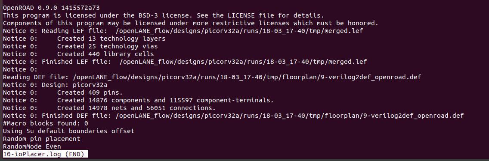
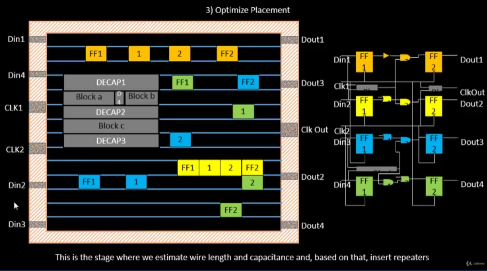
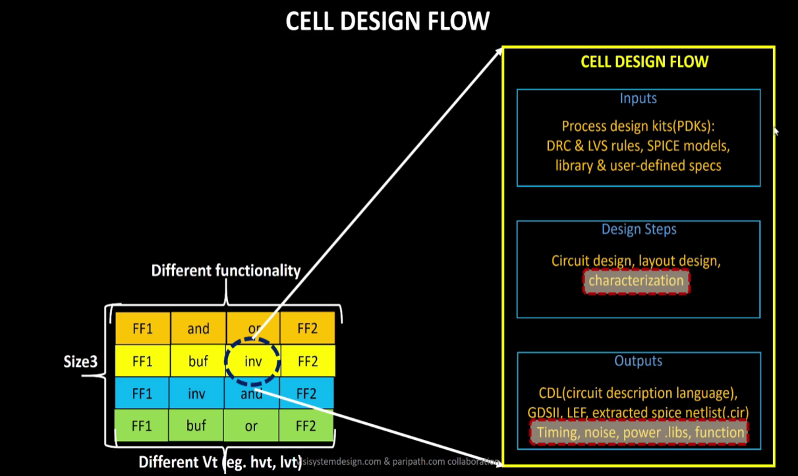
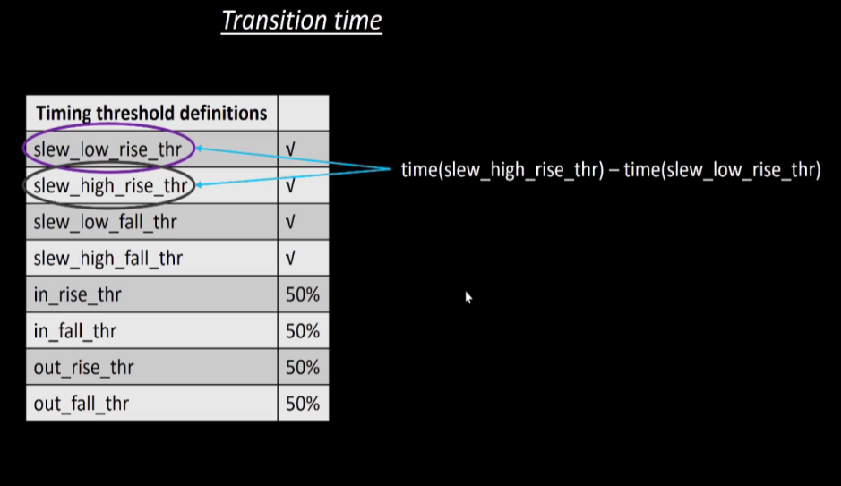
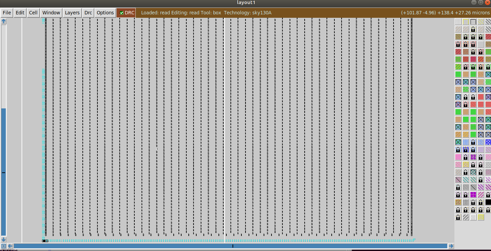
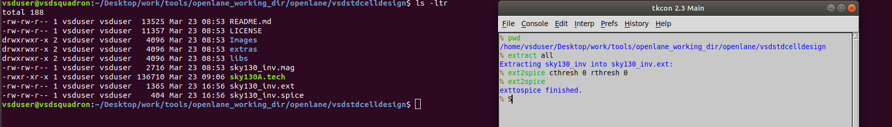
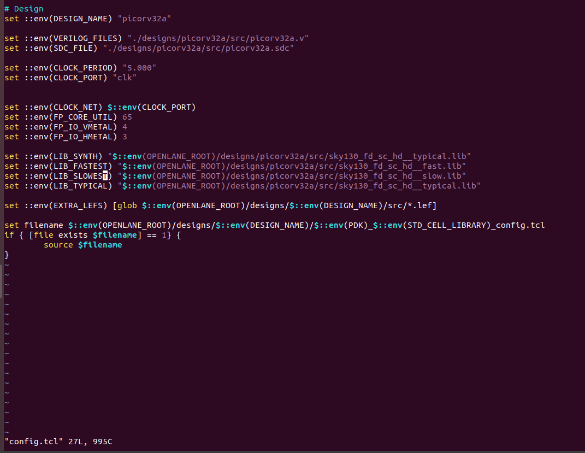
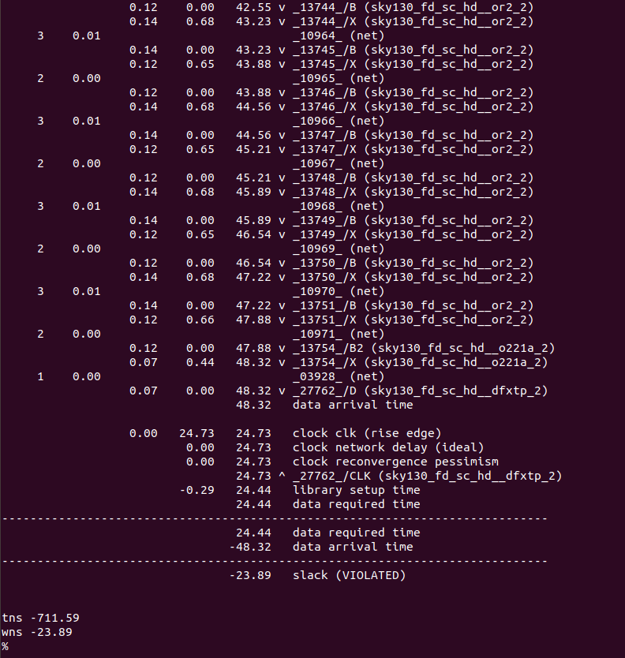
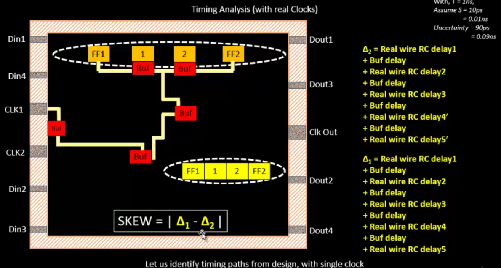
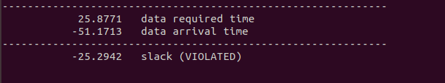

# NASSCOM-VSD-SOC
This repository consists of a 5 Day workshop conducted by NASSCOM and VSD on SOC Design and Planning. Also, this includes all the 5 Days learning from videos provided by VSD and LAB work on the OpenLANE tool provided by NASSCOM.<br>
<h4>Author:- <a href="https://www.linkedin.com/in/tanmay-agrawal-409746224/">Tanmay Agrawal</a></h4>

## Table Of Content
<ol>
  <li>
    <a href= "#day-1">Day-1: Inception of open-source EDA, OpenLANE and Sky130 PDK.</a>
  </li>
  <li><a href="#day-2">Day-2: Good floorplan vs bad floorplan and introduction to library cells.</a></li>
  <li><a href="#day-3">Day-3: Design library cell using Magic Layout and ngspice characterization.</a></li>
  <li><a href="#day-4">Day-4: Pre-layout timing analysis and importance of good clock tree.</a></li>
  <li><a href="#day-5">Day-5: Final steps for RTL2GDS using tritonRoute and openSTA.</a></li>
</ol>
<br>

## DAY-1
### Title: Inception Of Open-Source EDA, OpenLANE and Sky130 PDK.
<hr>
<h5>CONTENT:</h5>
<ol>
  <li><a href="#1-how-to-talk-to-computer">How to talk to computers</a></li>
  <li><a href="#2-soc-design-and-openlane">SOC Design and OpenLANE</a></li>
  <li><a href="#3-get-familiar-to-open-source-eda-tools">Get familiar to open-source EDA tools</a></li>
</ol>
<hr>

### 1. How to talk to computer
<hr>

<br>
This is the Arduino Leonardo board consisting of a Processor/SOC and various other interconnecting devices and peripherals.<br>
The highlighted part in the above figure is the on block where the entire VLSI moves around.<br><br>
The picture below dipicts the layout of the entire microcontroller board.<br>

<br>
Thus, this picture consists of various interconnect devices, external chips and various other devices present. Few features of this layout are:<br>
<ul>
  <li>The Centre part the processor/ SOC is the layout of the Chip that is highlighted on an Arduino Board.</li>
  <li>It comprises of various other devices like SRAM, EEPROM, ADCs and various other components that are combined and placed to make a microcontroller board </li>
</ul>
<br>
But, our main objective is to design a Processor/ SOC so the picture below depicts the design of a QFN-48 Package with the chip in the middle of it connected by bond wires or interconnect wires.
<br>

<br>
Also this Package comprises of a Die, I/O Pads, core. The layout of this is depicted below:<br>

<br>
Now, the core of this SOC consists of the Two major parts these are:<br>
<ul>
  <li>Foundry IP's: These the factories that helps to implement the design on the silicon wafer and also to make chips by there intelligence. These chips made by the foundrys are termed as foundry Intellectual Property.</li>
  <li>Macros: These are like a pure digital logics.</li>
</ul>

<br>
As, we are using RISC V Architecture also called Instruction Set Architecture (ISA) to design an SOC. The picture below depicts the flow from RTL2GDS.

<br>
Now, Let's move on to how the Software Applications connects to Hardwares.<br>
Shown, below is the entire flow of how the software connects to Hardware.
<br>

<br>
Now, we are taking the example of a stop watch flow and the implementation is done using RISCV Architecture.<br>

<br>
Thus, deep diving into the flow we observed that there is one more process after the Assembler is the use of HDL(Hardware Descriptive Language).<br>
We, convert the Binary Code into the HDL that signifies that what is the function that the entire hardware will be performing with that bit stream.<br>
Then, the next step after this is we synthesize the RTL flow for Physical Design Implementation.<br>

<br>
<hr>

### 2. SOC Design and OpenLANE

<hr>
<br>
 Let's understand the standard RTL to GDSII Flow. This is described below using the flow diagram:
 <br>
 
 <br>
 Now, let's take the first stage in the flow:<br>
 Synthesis: It Converts RTL to a circuit out of components from the standard cell library (SCL).<br>
 
 <br>
 The other stage is:<br>
 Floor and Power Planning: It is divided into two categories that are :<br>
 <ol>
   <li>Chip-Floor Planning: Partition the chip die between different system building blocks and place the I/O Pads.</li>
   <li>Macro-Floor Planning: Dimensions, pin locations, rows definition.</li>
 </ol>
 <br><br>
 Power Planning: The power network is connected by multiple vdd, vss and gnd.
 <br>
 
 <br>
 The next stage is:<br>
 Placement: Placing the cells on the floorplan rows, aligned with the sites.<br>
 
 <br>
 Placement is divided into 2 steps: Global and Detailed Placement.<br>
 
 <br>
 The next stage is:<br>
 
 <br>
The next stage is:<br>
 
 <br>
 The next stage is:<br>
 
 <br>
 <hr>

### 3. Get familiar to open-source EDA tools
 
 <hr>

 Let's Dive into the OpenLane toolkit provided to access the open-source software helping in the complete flow from RTL to GDSII.<br>
 <br>
 Now, First we try to get into the working directory on which we have to work to access the OpenLANE flow.<br>
 
 <br>
 The Path for the current working directory to operate will be:<br>
 ```console
 vsduser@vsdsquadron:~/Desktop/work/tools/openlane_workshop_dir/openlane/
```
<br>
 After entering into the above mentioned directory type command-<br>
 
```console
 vsduser@vsdsquadron:~/Desktop/work/tools/openlane_workshop_dir/openlane$ docker
```
<br>
to access all the tools available in the openLANE. Then command to start the session will be:<br>

```console
bash-4.2$ flow.tcl -interactive
```
<br>
 
 <br>
 By the meantime we can also explore the /openlane dir. Below are the listed item present in <br>
 
 ```console
 vsduser@vsdsquadron:~/Desktop/work/tools/openlane_workshop_dir/openlane$ cd designs/
 ```
 <br>
 
 <br>
 Coming back to the OpenLane interactive session. We will be preparing the design file for picorv32a. Command for preparing will be <br>
 
 ```console
 % prep -design picorv32a 
 ```
 <br>
 
 <br>
 After this for synthesizing the design we run the command <br>
 
 ```console
 % run_synthesis
 ```
 <br>
 
 <br>
 Now, switch to the design directory in the openlane directory. The cd to <br>
 
 ```console
 vsduser@vsdsquadron:~/Desktop/work/tools/openlane_workshop_dir/openlane/designs/picorv32a/runs/15-03_19-57$ cd reports/synthesis/less 1-yosys_4.stat.rpt
 ```
 to print the synthesis statistics.<br>
 
 <br>
 To calculate the Flop-Ratio:<br>
 Flop-Ratio= (Total number of D-Flip-Flops)/(Total number of cells)<br>
 %Flop-Ratio= Flop-Ratio*100%<br>
 Below represents the statistics of the synthesis:<br>
 <br><br><br>
<br>
Hence, from the above obtained statistics the Flop-Ratio will be:<br>
Flop-Ratio=(1613/14876)=0.1084296<br>
% Flop-Ratio = 10.84%<br>
<br>
This ENDS with the DAY1 workshop using an OpenLANE Toolkit.
<br>
<br>


## DAY-2
### TITLE: Good floorplan vs bad floorplan and introduction to library cells.
<hr>
<h5>CONTENT:</h5>
<ol>
  <li><a href="#1-chip-floor-planning-considerations">Chip Floor Planning considerations</a></li>
  <li><a href="#2-library-binding-and-placement">Library Binding and Placement</a></li>
  <li><a href="#3-cell-design-and-characterization-flows">Cell design and characterization flows</a></li>
  <li><a href="#4-general-timing-characterization-parameters">General timing characterization parameters</a></li>
</ol>
<hr>

### 1. Chip Floor Planning considerations
<hr>
<br>
This module begins with the basic concepts of floor planning that includes netlisting defining width and height of core and die.<br>
Now let's begin by defining the Netlist: It describes the connectivity between all the Electronic components.<br>
Below, represents the netlisting of the various Flip-Flops and logic gates.<br>
<br>
For, placing the netlist in the core of the chip we need to convert the logic gates into the specified physical dimensions. So, that they are to correctly placed inside the core.<br>
Below, is the representation of the conversion of netlist into physical dimensions.<br>
<br>
Now, to calculate the exact dimensions of the core and die we need to first specify the dimensions of the standard cells (logic gates) and Flip-Flops.<br>
Below is the measurement of the std. cell and the Flip-Flop for further calculation of the core.<br>
<br>
<br>
Let's define what is the core on the silicon wafer??<br>
Core is defined as the section of the chip where the fundamental logic of the design is placed.<br>
<br>
What is the Die on the silicon wafer??<br>
Die consists of core, it is a small semiconductor material specimen on which the fundamental circuit is fabricated.<br>
<br>
Let's calculate the Two main parameters in the context of a core and die.<br>
These are: a). Utilization factor and b). Aspect Ratio.<br>
Below is the mathematical representation of these parameters.<br>
<br>
In the above example the core is 4unit*2unit = 8sq. units. But, the Netlist has the dimension of 2unit * 2unit = 4sq. units.<br>
Thus, the Utilization Factor = 0.5 and the Aspect Ratio = 0.5 <br>
<br>
Now, in this idea of floor planning lets come up to How to define the location of Pre-Placed cells. To implement this we cut the netlist into different parts and implement that considering each block as the individual black box.<br>
The above statement is depicted below.<br>

<br>

<br>
Now, the two different Boxes are to be termed as two different IP's or modules.<br>

<br>
Various other different examples of the IP's and modules are shown below.<br>

<br>
Now, lets define different terminologies.These are:<br>
1. Floorplanning: The arrangements of these IP's onto a chip.<br>
2. Pre-Placed Cells: These IP's / Blocks have user-defined locations, and hence are placed in chip before automated placement-and-routing.<br>
Thus, the Pre-Placement is shown below.<br>
<br>
The concept of Decoupling capacitor and its relevance in the floorplan and in the circuits are explained below.<br>
<br>

<br>

<br>
So, the overcome the mid range of noise margin i.e., from VIH to VIL we will place the Decoupling capacitor.<br>
The advantage of decoupling capacitor is represented in the diagram below.<br>

<br>
Thus, the final placement onto the core of the die is shown below.<br>

<br>
Consider different macros /  IP's are interconnected to each other with power supply and there is the connection established between a Driver and a Load as shown below.<br>

<br>
These buses are a 16-bit bus, lets say it is connected to an inverter. Then they encounter with the problem of Ground Bound and Voltage Droop as shown below.<br>

<br>
<br>
To overcome the above depicted drawbacks we use multiple rails of vdd and vss so that any logic circuit can withdraw the required potential from the nearest branch.<br>
<br>
Thus, the final pin placement on a core of a die will be done as shown.<br>
<br>
Now, we are taking a design to understand the placement and routing on silicon.The complete design is shown below.<br>
<br>
This the final placement of the input and output pins with the logical cell placement blockage which is used to block the automatic routing and placement is done and shown below.<br>
<br>
<br>
Now, moving to OpenLANE to understand the concept of floor-planning and automated placement and routing.<br>
After the Day1 synthesis and calculation of Flop Ratio now we are diving in the concepts of Floorplanning, Placement and Routing.<br>
There are three files at different locations they are priortized according to there considerations that which values overwrites the other.<br>
This heirarcy is shown below.<br>
<br>
<br>
Now, in the interactive window write the command.<br>

```console
%run_floorplan
```
<br>
<br>
Then, cd to the specified directory to look into the merged and final vmetal and hmetal and core utilisation as per the priority order.<br>

```console
cd openlane/designs/picorv32a/runs/18-03_17-40/logs/floorplan/less io-Placer.log
```
<br>
Shown below is the final file.<br>
<br>
Also, to check the die area cd to the below directory.<br>

```console
cd  openlane/designs/picorv32a/runs/18-03_17-40/results/floorplan/less picorv32a.floorplan.def
```
<br>
The output will be as shown.<br>

<br>
Now, to open the Layout we use magic.<br>
The following command in the same directory as above mentioned will help to open the layout editor.<br>

```console
magic -T /home/vsduser/Desktop/work/tools/openlane_working_dir/pdks/sky130A/libs.tech/magic/sky130A.tech led read ../../tmp/merged.lef def read picorv32a.floorplan.def &
```
<br>
Shown below is the layout of the die and all the pre-placed cells and std cells on the layout are shown below.<br>
<br>
<br>
If we want to know the details of the specific I/O port. Then we select it and write what in the tkcon.tcl window.<br>
<br>
<br>
<hr>

### 2. Library Binding and Placement
<hr>
To understand the concept of Placement Lets consider a net consisting of a pre-placed cells and standard cells.
<br>
<br>
So, for placement on the core we specify some physical dimensions to each and every cell. Thus, this is termed as Library. It consists of various pre-defined std. cells and pre-placed cells.<br>
<br>
Thus, the complete setup of floorplan, netlist and library management is shown.<br>
<br>
Now, after placing all the cell from the library onto the core of the die considering no distruption in the pre-placed cells. Thus, this the stage where we estimate wire length and capacitances and based on that we insert repeaters. Thus, this is termed as optimised placement.<br>
<br>
Now, to checking the optimisation of the placement for each section.<br>
The first section is placed as shown.<br>
<br>
The second section is placed as shown.<br>
<br>
The Third section is placed as shown.<br>
<br>
The Last section is placed as shown.<br>
<br>
<br>
Now, In Library Characterization and Modelling these 5 steps a very important role. These are as follows:<br>
<ol>
      <li>Logic Synthesis.</li>
      <li>Floorplanning.</li>
      <li>Placement.</li>
      <li>CTS (Clock Tree Synthesis).</li>
      <li>Routing</li>
</ol>
<br>
<br>
One common thing across all the stages are "GATES or CELLS".<br>
<br>
<br><br>
Now, lets simulate the above learned placement using the OpenLANE toolkit.<br>
Run the following command after synthesis and floorplanning.<br>

```console
%run_placement
```
<br>
The move into the following directory to open magic placement.<br>

```console
cd openlane/designs/picorv32a/runs/19-03_15-04/results/placement
```
<br>
To open the magic from the placement directory. We use the command given below.<br>

```console
magic -T /home/vsduser/Desktop/work/tools/openlane_working_dir/pdks/sky130A/libs.tech/magic/sky130A.tech led read ../../tmp/merged.lef def read picorv32a.placement.def &
```
<br>
<br>
This shows the legal placement of standard cells.<br>
<br>
<hr>

### 3. Cell design and characterization flows
<hr>
Thus, After final placement and routing for the above netlist the final die will be represented as shown.<br>
It consists of standard cells (all the basic logic gates or cells) that are stored in the Library.<br>
<br>
Also, the library consists of various varities of std. cells of different sizes and different functionality.<br>
<br>
Now, lets divide the designing of each std. cell. Thus, the cell design flow is as follows.<br>
<br>
The first design step i.e., Inputs is classified as shown below.<br>
<br>
<br>
The second step is the Design Step or the circuit design step also consists of an addition step of CDL (circuit description language).<br>
<br>
<br>
Now, lets move to the layout design step taking the Euler's path into consideration. Also, the layout of a cmos inverter is made on magic is shown below.<br>
<br>
<br>
Now, the last stage the Output stage also consists of the GDSII file, LEF and extracted spice netlist file that helps in determining the Time, noise and power characterstics of the circuit.<br>
<br>
Now, the characterization flow is described in 1-8 steps and then they are passed into the software GUNA the results to an output model file that characterizes the timing, noise and power states of a circuit.<br>
<br>
<br>
<br>
<hr>

### 4. General timing characterization parameters
<hr>
Now, lets analyse the timing characterstics for a stimulus applied as an input to the buffer and various timing analyses comprises of input and output slew rates input and output rise and fall threshold timings etc.<br>
<br>
<br>
<br>
<br>
<br>
<br>
<br>
<br>
Now, lets calculate the propagation delay and the transition time.<br>
The negative propagation delay shows that the circuit is not proparly synchronised.
<br>
Positive Propagation delay:<br>
<br>
Negative Propagation delay:<br>
<br>
Input transition time:<br>
<br>
Output transition time:<br>
<br>
The final transition delay calculation.<br>
<br>
<br>
<br>


## DAY-3
### TITLE: Design library cell using Magic Layout and ngspice characterization.
<hr>
<h5>CONTENT:</h5>
<ol>
  <li><a href="#1-labs-for-cmos-inverter-ngspice-simulations">Labs for CMOS inverter ngspice simulations</a></li>
  <li><a href="#2-inception-of-layout-and-cmos-fabrication-process">Inception of Layout and CMOS fabrication process</a></li>
  <li><a href="#3-sky130-tech-file-labs">Sky130 Tech File Labs</a></li>
</ol>
<hr>

### 1. Labs for CMOS inverter ngspice simulations
<hr>
<br>
In this lab first we try to change the i/o ports placement schemes by using io placer.<br>
After running floorplan cd to the given directory.<br>

```console
cd openlane/designs/picorv32a/runs/21-03_18-42/results/floorplan/
```
<br>
Run the following command after comming to the above mentioned directory.<br>

```console
magic -T /home/vsduser/Desktop/work/tools/openlane_working_dir/pdks/sky130A/libs.tech/magic/sky130A.tech led read ../../tmp/merged.lef def read picorv32a.floorplan.def &
```
<br>
The io placement before changing the configurations.<br>
<br>
Now, change the directory to the following location to fetch the path that should be changed to change io settings.<br>

```console
cd openlane/configuration/less floorplan.tcl
```
<br>
Then, place the following commands in the interactive window and check the layout again by the above mentioned procedure.<br>

```console
%set ::env(FP_IO_MODE) 2
%run_floorplan
```
<br>
<br>
Now, we have a SPICE deck as shown below.<br>
<br>
<br>
Now, lets clone the repository containing the inverter layout and run all the post-layout simulations.<br>

```console
cd openlane/
```
<br>
Command to clone from the above directory.<br>

```console
git clone https://github.com/nickson-jose/vsdstdcelldesign.git
```
<br>
Now, change to the clone directory and copy the tech file from the below mentioned directory.<br>

```console
cd openlane_working_dir/pdks/sky130A/libs.tech/cp sky130A.tech /home/vsduser/Desktop/work/tools/openlane_working_dir/openlane/vsdstdcelldesign/
```
<br>
Now, open the layout from the vsdstdcelldesign directory by using the following command.<br>

```console
magic -T sky130A.tech sky130_inv.mag &
```
<br>
Now, the layout of the CMOS inverter will be shown below.<br>
<br>
<hr>

### 2. Inception of Layout and CMOS fabrication process
<hr>
<br>
This, module completely deals with the fabrication process of a Twin-Well CMOS device fabrication.<br>
Lets, find that which layer consists of which type and also extract the spice file to get all the parasitics.<br>
The below shown are the different layers and their description.<br>
<br>
<br>
<br>
<br>
<br>
Now, create and extract file from the tckon.tcl window.<br>

```console
%extract all
```
<br>
Thus, the extract file is created.<br>
<br>

Now, create an Spice file from the tckon window.<br>

```console
%ext2spice cthresh 0 rthresh 0
%ext2spice
```
<br>
Thus, the spice file is created and shown below.<br>
<br>
Now, open the spice file using the following command.<br>

```console
vim sky130_inv.spice
```
<br>
<br>
<hr>

### 3. Sky130 Tech File Labs
<hr>
<br>
In this we will characterise the extracted spice file through the vim editor and the file after changes is shown below.<br>
<br>
Now, we run the ngspice simulation.<br>

```console
ngspice sky130_inv.spice
```
<br>
The following will be the output.<br>
<br>
Now, we plot the output vs time curve to calculate the rise and fall transition time and the rise and fall delay time.<br>

```console
plot y vs time a
```
<br>
The output is:<br>
<br>
The Rise transition data points at 20% and 80% are shown below.<br>
<br>
Thus, Rise transition = 2.24025e-09 - 2.17995e-09 = 60.30ps
<br>
The fall transition data points at 80% and 20% are shown below.<br>
<br>
Thus, Fall transition = 4.05075e-09 - 4.09369e-09 = - 42.94ps
<br>
The Rise delay data points at 50% input and 50% output are shown below.<br>
<br>
Thus, Rise delay = 2.20781e-09 - 2.15078e-09 = 57.03ps
<br>
The fall delay data points at 50% input and 50% output are shown below.<br>
<br>
Thus, Fall transition = 4.07547e-09 - 4.05004e-09 = 25.43ps
<br>
<br>
Now, taking the Lab challanges that are to fix poly.9 error and to implement polyresistor spacing to diff and tap also to describe DRC error as geometrical construct and last challenge is to find the missing and incorrect rules.<br><br>
Shown below is the poly resistor challenge.<br>
<br>
<br>
<br>
Shown below is the n_well missing rule challenge.<br>
<br>
<br>
<br>


## DAY-4
### TITLE: Pre-layout timing analysis and importance of good clock tree.
<hr>
<h5>CONTENT:</h5>
<ol>
  <li><a href="#1-timing-modelling-using-delay-tables">Timing modelling using delay tables</a></li>
  <li><a href="#2-timing-analysis-with-ideal-clocks-using-opensta">Timing analysis with ideal clocks using openSTA</a></li>
  <li><a href="#3-clock-tree-synthesis-tritoncts-and-signal-integrity">Clock tree synthesis TritonCTS and signal integrity</a></li>
  <li><a href="#4-timing-analysis-with-real-clocks-using-opensta">Timing analysis with real clocks using openSTA</a></li>
</ol>
<hr>

### 1. Timing modelling using delay tables
<hr>
<br>
Now, in this module we talking about the timing modelling and delay tables and also the conversion of grid info to track info.<br>
In this we also convert the magic layout to std cell LEF.<br>
Now lets convert the grid info to track info.<br>
Path to open the track info file.<br>

```console
cd openlane_working_dir/pdks/sky130A/libs.tech/openlane/sky130_fd_sc_hd/less tracks.info
```
<br>
Now, open the magic layout from the below directory.<br>

```console
cd openlane/vsdstdcelldesign/
```
<br>

Now the command to open Magic layout will be:<br>

```console
magic -T sky130A.tech sky130_inv.mag &
```
<br>
Now, converting the grid info to track info from the Tkcon.tcl window.<br>
<br>
The tracks.info file is shown below.<br>
<br>
From the above changed grid layout we observed that the input and output ports are lying on the intersection of X and Y pitches.<br>
Now, lets convert the magic layout to the std cell LEF file. We first make the copy of the layout by using the following command from the Tkcon.tcl window.<br>

```console
% save sky130_vsdinv.mag
```
<br>
<br>
Also, the layout of the copied cell is shown below.<br>
<br>

Now, convert the following layout into the lef file by using the following command.<br>

```console
% lef write
```
<br>
Now, the .mag and .lef both files are generated and the lef file is shown below.<br>
<br>
Thus, each and every port is prioritized by using the following class and use commands and they are written in the lef file as per their order.<br>

```console
% port class input
% port use signal
```
<br>
Now, lets see the steps that how to include a new cell in synthesis.<br>
Let's copy 4 files that are the .lef file and all the 3 files at all temperature corners. To the following picorv32a design directory.<br>

```console
/home/vsduser/Desktop/work/tools/openlane_working_dir/openlane/designs/picorv32a/src
```
<br>
The location of the lef file is:<br>\
File name: sky130_vsdinv.lef<br>

```console
cd openlane/vsdstdcelldesign/
```
The other 3 files are at the following location:<br>
File names:<br>
<ol>
<li>sky130_fd_sc_hd__fast.lib</li>
<li>sky130_fd_sc_hd__slow.lib</li>
<li>sky130_fd_sc_hd__typical.lib</li>
</ol>
<br>

```console
cd openlane/vsdstdcelldesign/libs/
```
<br>
Now, again change the directory to designs/picorv32a to change the config.tcl file.<br>
The updated config.tcl file should be like this.<br>
<br>
Then, open the interactive window in the new tab for the synthesis of the new cell.<br>
Following commands are to be used step be step before running synthesis command.<br>

```console
docker

flow.tcl -interactive

package require openlane 0.9

prep -design picorv32a -tag 23-03_10-48 -overwrite

set lefs [glob $::env(DESIGN_DIR)/src/*.lef]

add_lefs -src $lefs

run_synthesis
```
<br>
Thus, after running the synthesis we will encounter with the huge slack so to remove that we will see it further.<br>
Now, lets understand the usage of delay tables for timing modelling and power aware Clock tree synthesis (CTS).<br>
<br>
Thus, as the 2nd stage of the gates are of same type thats why we have a 0 values skew. But, if this configuration is changed then we encounter with the non zeroed skew and on the large scale it will lead to a large amount of skew and output latency.<br>
Also, the power aware CTS is shown below as we keep on the any one gate at a time for 2nd stage.<br>
<br>
Now, the steps to configure the synthesis settings to fix slack and to include vsdinv file.<br>
Set all the parameters then run the synthesis as per the commands below in the serial order.<br>

```console
set ::env(SYNTH_STRATEGY) 1
set ::env(SYNTH_BUFFERING) 1
set ::env(SYNTH_SIZING) 1
init_floorplan
place_io
global_placement_or
detailed_placement
tap_decap_or
detailed_placement
```
<br>
Then, change to the following directory to see the magic layout.<br>

```console
cd openlane/designs/picorv32a/runs/23-03_10-48/results/placement
```
<br>
By using the following command open the magic layout from the above folder.<br>

```console
magic -T /home/vsduser/Desktop/work/tools/openlane_working_dir/pdks/sky130A/libs.tech/magic/sky130A.tech led read ../../tmp/merged.lef def read picorv32a.placement.def &
```
<br>
Thus, the following output will be shown.<br>
<br>
To get the detailed view use the following command from Tkcon.tcl window.<br>

```console
expand
```
<br>
<br>
Thus, the vsd_inv cell in the final layout is shown below.<br>
<br>
Hence, we are able to fix the slack and sucessfully included vsdinv file.<br>
<hr>

### 2. Timing analysis with ideal clocks using openSTA
<hr>
<br>
In this set of modules we learn about the Setup Timing analysis and analysing timings with Ideal Clocks.<br>
<br>
The clock provided by the PLL's will provide a temporary variation of the clock period this is termed as Jitter.<br>
<br>
Thus, the final setup timing after introducing the jitter timing in the entire clock period.<br>
<br>
Now, the setup time for a set of logic will be calculated as shown below but this should be less then the setup time calculated in the above diagram.<br>
<br>
<br>
Now, lets see this observation practically on openLANE by making 2 different files on different locations.<br>
File name: my_base.sdc<br>
Path:<br>

```console
cd openlane/designs/picorv32a/src/
```
<br>
<br>
File name: pre_sta.conf<br>
Path:<br>

```console
cd openlane/
```
<br>
<br>
So, to run the pre_sta.conf file write the below command from the above directory itself.<br>

```console
sta pre_sta.conf
```
<br>
Now, the slack in 1st iteration is:<br>
<br>
Now, the slack after improvement is:<br>
<br>
<hr>

### 3. Clock tree synthesis TritonCTS and signal integrity
<hr>
<br>
In this set of modules we learnt about the clock tree routing and buffering using H-Tree algorithm.
Below shown is the H-Tree algorithm used in CT routing.<br>
<br>
Also the Buffering in Clock Tree Routing is done as shown below.<br>
<br>
Also, we looked into the problem of crosstalk in routing which leads to increase the delay in the ckt. Thus, to overcome this we do clock net sheilding.<br>
<br>
<br>
Now, to run the clock tree synthesis we use the following command from the interactive window.<br>

```console
run_cts
```
<br>
Thus, the CTS is completed and shown below.<br>
<br>
<br>
Thus, the CTS RUNS are verified and shown below.<br>
<br>
<hr>

### 4. Timing analysis with real clocks using openSTA
<hr>
<br>
In this module we understand the setup and hold timing analysis using real clocks.<br>
Thus, the setup timing analysis and the slack definition is shown below.<br>
<br>
Also, the Hold timing analysis and the slack definition in the case of hold time is shown below.<br>
<br>
Thus, on the chip level the delay time for the Launch Flop is shown below.<br>
<br>
Also, the delay time for the Capture Flop and the Skew value is shown below.<br>
<br>
Thus, the value for hold timing and setup timing is shown below.<br>
<br>
<br>
Thus, all this timing design is for a single clock.<br>
Now. for doing timing analysis for the real clocks we invoke the openroad.<br>

```console
openroad
```
<br>
After invoking it we now create a db file and to create it we read various files as shown below.<br>
<br>
Now, after checking the reports we come up with the Hold and SetupTime delays.<br>
Hold slack :<br>
<br>
Setup Slack :<br>
<br>
But, the process we are going with is incorrect.<br>
Now, we read the created db file directly and obtain the hold and setup time slack.<br>
<br>
Hold slack:<br>
<br>
Setup Slack:<br>
<br>
<br>


## DAY-5
### TITLE: Final steps for RTL2GDS using tritonRoute and openSTA.
<hr>
<h5>CONTENT:</h5>
<ol>
  <li><a href="#1-routing-and-design-rule-check-drc">Routing and design rule check (DRC)</a></li>
  <li><a href="#2-power-distribution-network-and-routing">Power Distribution Network and Routing</a></li>
  <li><a href="#3-tritonroute-features">TritonRoute Features</a></li>
</ol>
<hr>

### 1. Routing and design rule check (DRC)
<hr>
<br>
In this module we are dicussing the routing techniques to route the std cells and macros on the core of a die.<br>
We learnt about the Maze Routing strategy also known as Lee's Algorithm.<br>
<br>
This algorithm always take two points one as a source and one as a target and basically chooses the shortest with minimum no. of bends.<br>
<br>
Now, after successfull routing of all the cells we do the design rule check (DRC).<br>
The few DRC voilations are shown below.<br>
<br>
<br>
<br>
Now, the method to avoid Signal Shorting is to introduce another layer which are connected through a via.<br>
<br>
<br>
Now, the final stage is Parasitic Extraction.<br>
<br>
Thus, the routing strategy on a chip is shown as below.<br>
<br>
<hr>

### 2. Power Distribution Network and Routing
<hr>
<br>
Now after Synthesis, floorplanning, placement and cts we are comming to the routing stage.<br>
After the cts run few commands from starting of an openlane.<br>

```console
docker

flow.tcl -interactive

package require openlane 0.9

prep -design picorv32a -tag 23-03_10-48      #(we do not overwrite it as it will remove the cts otherwise)

echo $::env(CURRENT_DEF)
```
<br>
Now, to build the power distribution network we use the following command.<br>

```console
gen_pdn
```
<br>
<br>
Now before running routing setup the TritonRoute strategy as 0 then it will use the Triton13 as shown in figure.<br>
<br>
Then run the following command:<br>

```console
run_routing
```
<br>
Thus, we obtained the routing results as:<br>
<ol>
  <li>The number of voilations = 0</li>
  <li>Obtained the picorv32a.spef file</li>
</ol>
<br>
<br>
<br>
<br>
<hr>

### 3. TritonRoute Features
<hr>
<br>
In this module we learnt various features of TritonRoute.<br>
<br>
<br>
<br>
<br>
<br>
<br>
<br>
We also learnt the Routing Topology Algorithm that uses MST technique.<br>
<br>
<hr>
Thus, we successfully obtained the spef file and we learnt to create our own design and the entire PnR flow.<br> 
<h4><a href="#nasscom-vsd-soc"> BACK TO TOP </a></h4>
